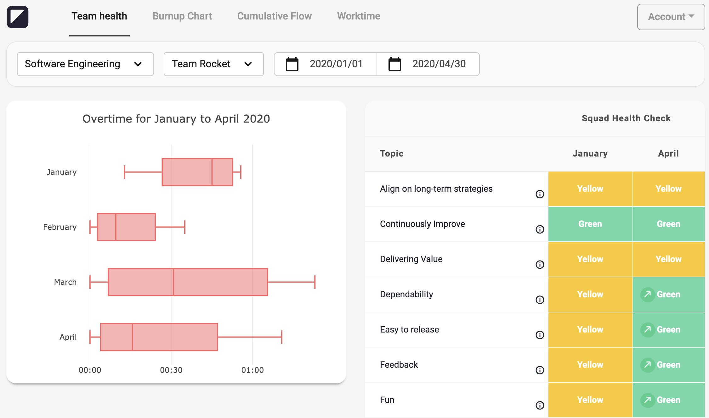
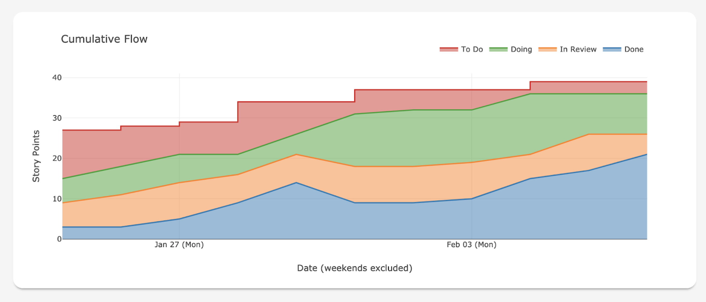
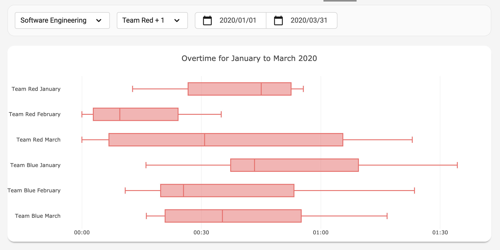
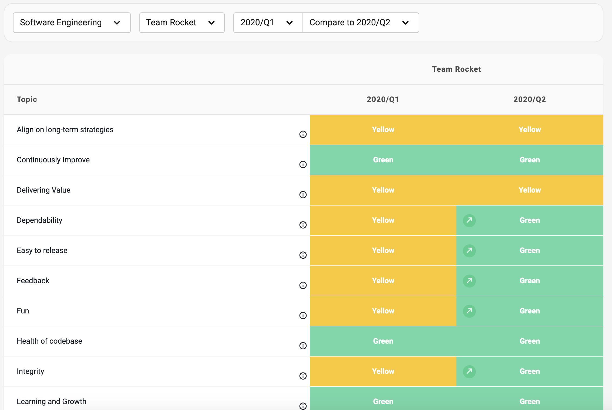

# Team Metrics Visualizer

Team Metrics Visualizer is a tool that teams can use to aggregate data from various sources and create helpful visualisations from it. It can be customized and extended to a team's context and needs.

This is how it looks like, with a dashboard showing worktime and results from Squad Health Check for a team:

See [available visuals](#available-visuals) for a list of all visuals currently included. In [supported data-sources](#Supported-data-sources) you can see what kind of data you can add.

Team Metrics Visualizer is at a very early stage of development. Some APIs may change in the future and the tool still has a few rough edges. However, in [TRI-AD](https://www.tri-ad.global/), we use it every day and it is already useful to us. This is why we wanted to share it with the world at such an early time.

## 🔰 Getting started

### 📦 Requirements

* [Python 3](https://www.python.org/)
* [Pipenv](https://pipenv.pypa.io/en/latest/)
* [Docker](https://www.docker.com/)
* [npm](https://www.npmjs.com/)

For convenient management of Python-versions, you can use [pyenv](https://github.com/pyenv/pyenv) together with [pipenv](https://pipenv.pypa.io/en/latest/) if you want, but it is not required.

### 🖥 Development environment setup

_Note_: All paths given here are relative to the project root.

After cloning the repo, perform the following steps to create your development environment:

1. Install dependencies: ``pipenv sync --dev --python /path/to/your/python3.8``.
1. Install pre-commit hooks: ``pipenv run pre-commit install``.
1. Create ``.env``-file in folder ``tmv`` for configuration. You can find a ``sample.env`` with all required configuration variables in folder `docs`. Uncomment and change the attributes below `Configuration for tmv-docker-dev` for setting up the environment
1. Switch to folder ``tmv-docker-dev``.
1. Start database container for local development: ``./run_docker-compose.sh``.
1. Switch to custom dash components folder ``tmv_dash_components``.
1. Install dependencies: ``npm i``.
1. Build custom components: ``pipenv run npm run build``.
1. Switch back to app folder ``tmv``.
1. Initialize database: ``pipenv run flask db upgrade head``.

#### 📖 Documentation

You can build the documentation by running `make html` in folder `docs`. The HTML-files will be in `docs/_build/html/`. We will upload the docs to a hosting service soon.

### 🚀 Launch for local development

1. Start database container by executing ``./run_docker-compose.sh`` in folder ``tmv-docker-dev``
1. Start celery: ``pipenv run celery -A runcelery:celery worker -B --loglevel=info``. If you have trouble with this, check the FAQs in the documentation.
1. Open a different shell window and start app from folder tmv: ``pipenv run flask run``.

App is reachable at <http://127.0.0.1:8050/>.

If this is the first time you run the app, it is recommended to add yourself as superuser:

1. Add a user: ``pipenv run flask users create --active <your e-mail>``.
1. Add superuser privileges: ``pipenv run flask roles add <your e-mail> superadmin``.

### After pulling a new version

If dependencies were changed (modified `Pipfile`/`Pipfile.lock`), make sure to update
your Python-environment by running `pipenv sync --dev --python /path/to/your/python3.8`.

Always make sure, that your database has the same revision as the ORM. To do so, run this command to upgrade your database to the newest revision: `pipenv run flask db upgrade head`.

### 👩🏻‍💻 Contribution

If you want to contribute to this tool, please have a look at `CONTRIBUTING.md`. 🙂

### ☎️ How to contact

In case you found a bug or a security issue, please [create a GitHub-issue](https://github.com/tri-ad/team-metrics-visualizer/issues/new), describing what led to the error. We will try to fix it as soon as possible.

In case you have trouble using the tool or setting up the environment, please also create an issue and we will try to help you out or expand the documentation.

## Included functionality

Here is a brief overview of the functionality currently included in Team Metrics Visualizer. Please refer to the documentation for more details.

### Available visuals

#### Burnup chart and Cumulative Flow Diagram

#### Overtime chart

#### Squad Health Check result

### Supported data sources

#### Sprint progress

* ✅ Synchronized with JIRA via JIRA's API
* 🔜 Manual input

#### Worktime

* ✅ Import from spreadsheet
* ✅ Manual input

#### Squad Health Check

* ✅ Manual input
* ✅ Import from spreadsheet via command line
* 🔜 Import from spreadsheet via UI
