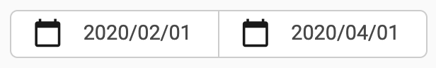

Slicers
=======

Slicers are used to filter data in the visuals that make up a dashboard. There is a 
variety of pre-made slicers which you can use in your dashboards to filter your data, 
for example, by teams or date ranges. This is how a slicer looks like:

Visuals know that they need to update their content after a slicer has changed by the
callbacks you defined. The ``slicers``-module already contains some useful callbacks, 
which you can just include in your dashboard.

Slicers keep their selection across dashboards using the ``slicers.state``-module.

Date-slicers
-------------

.. automodule:: slicers.dates
   :members:
   :undoc-members:
   :show-inheritance:

Filters for teams and sprints
------------------------------

.. automodule:: slicers.organization
   :members:
   :undoc-members:
   :show-inheritance:

State-saving across dashboards
------------------------------

.. automodule:: slicers.state
   :members:
   :undoc-members:
   :show-inheritance:

Slicers specifically for team health check
------------------------------------------

.. automodule:: slicers.team_health_check
   :members:
   :undoc-members:
   :show-inheritance:
